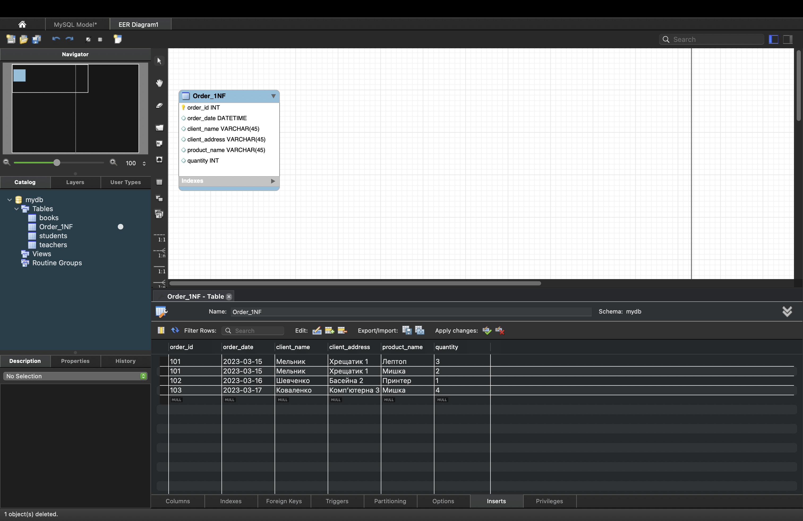
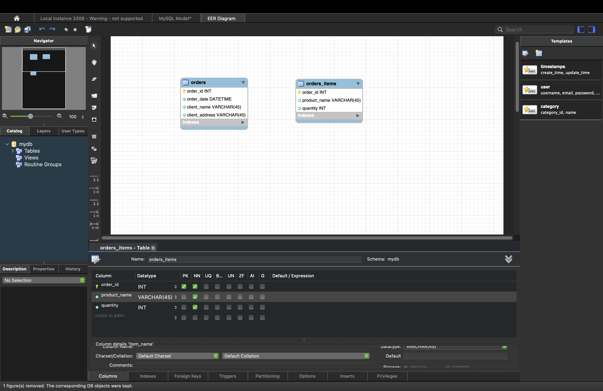
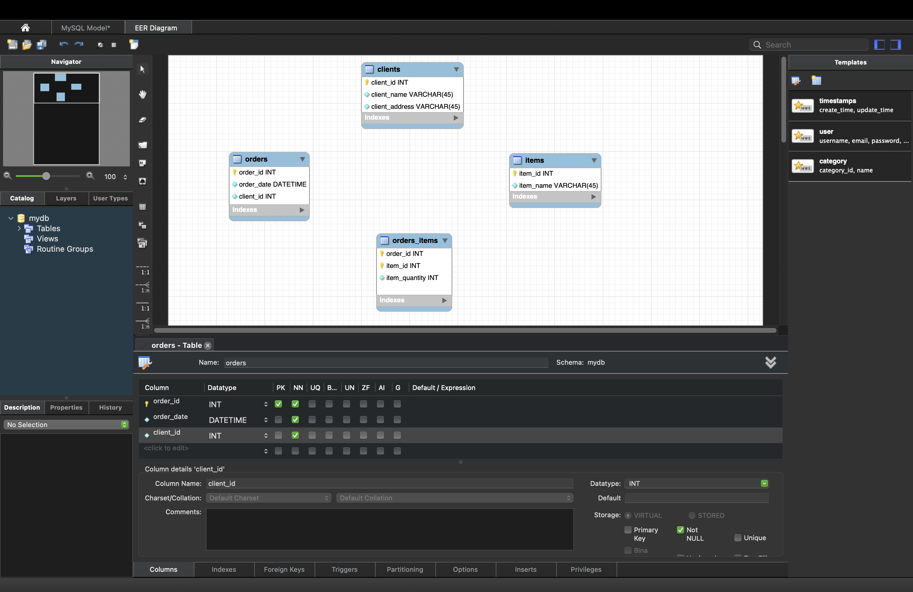
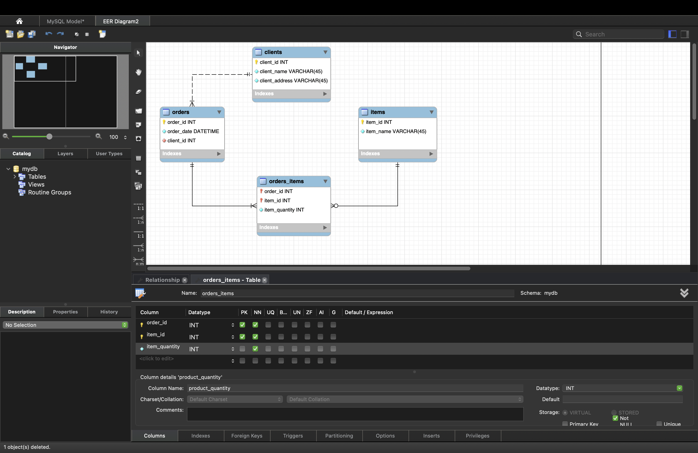
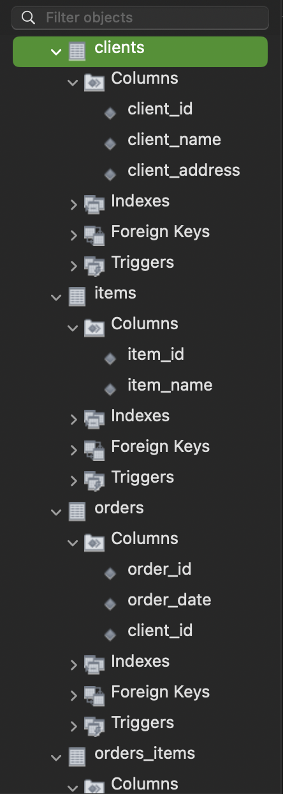
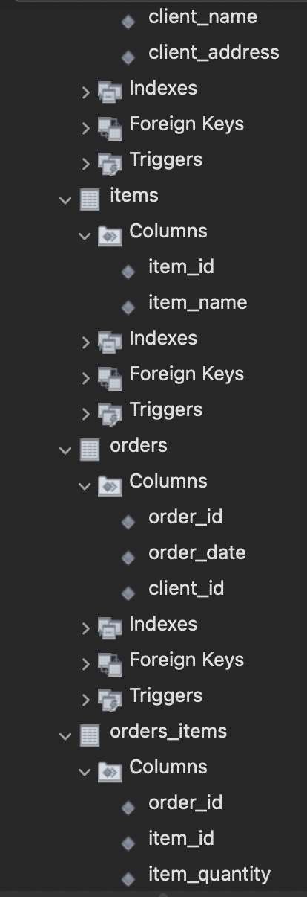

# goit-rdb-hw-02 — Нормалізація (1НФ → 2НФ → 3НФ) + ERD + створення таблиць

## Мета роботи
1. Перевести початкову (денормалізовану) таблицю у **1НФ**.
2. Перевести отримані таблиці у **2НФ**.
3. Перевести отримані таблиці у **3НФ**.
4. Побудувати **ER-діаграму** для таблиць 3НФ.
5. За ER-діаграмою створити таблиці в **MySQL** (тільки колонки + ключі + зв’язки).

---

## Початкові дані (Raw task)
У початковій таблиці є проблема з повторюваними групами (в одному полі може бути кілька товарів і кількостей), тому вона не відповідає 1НФ.


---

## Крок 1 — 1НФ
### Що зроблено
- Усі значення зроблено **атомарними**: один рядок = **одна позиція замовлення**.
- `order_id` може повторюватись для різних товарів одного замовлення.

**Таблиця (1НФ):**
- `order_id`
- `order_date`
- `client_name`
- `client_address`
- `product_name`
- `quantity`



---

## Крок 2 — 2НФ
### Логіка
У 1НФ ключ фактично стає складеним (наприклад `order_id + product_name`), і частина атрибутів залежить тільки від `order_id` (дата/клієнт), тобто є **часткові залежності**.

### Що зроблено
Розділено на:
1) **orders**
- `order_id` (PK)
- `order_date`
- `client_name`
- `client_address`

2) **orders_items**
- `order_id` (FK → orders.order_id)
- `product_name`
- `quantity`



---

## Крок 3 — 3НФ
### Логіка
У 2НФ все ще лишаються **транзитивні залежності**:
- Дані клієнта краще винести в окрему сутність `clients`.
- Товари/підписки — в окрему сутність `items`.
- У таблиці зв’язку використовувати ідентифікатори (`item_id`), а не назви.

### Що зроблено (фінальна структура 3НФ)
1) **clients**
- `client_id` (PK)
- `client_name`
- `client_address`

2) **orders**
- `order_id` (PK)
- `order_date`
- `client_id` (FK → clients.client_id)

3) **items**
- `item_id` (PK)
- `item_name`

4) **orders_items**
- `order_id` (PK, FK → orders.order_id)
- `item_id` (PK, FK → items.item_id)
- `item_quantity`



---

## ER-діаграма (для 3НФ)


### Кардинальності (як читати зв’язки)
- **clients (1) → orders (0..N)**  
  Один клієнт може мати 0 або багато замовлень. Кожне замовлення має рівно 1 клієнта.
- **orders (1) → orders_items (0..N)**  
  Одне замовлення може мати 0 або багато позицій (часто логічно ≥1, але це не завжди жорстко контролюється FK). Кожна позиція належить рівно 1 замовленню.
- **items (1) → orders_items (0..N)**  
  Один товар може ніколи не бути замовленим (0), або бути в багатьох позиціях. Кожна позиція посилається рівно на 1 товар.

---

## Створення таблиць у MySQL (Workbench)
Таблиці створено в БД `mydb` згідно ERD (колонки + ключі + зв’язки).




---

## DDL (опціонально, для відтворення)
Нижче приклад SQL-скрипта, який відтворює структуру 3НФ (можна виконати у Workbench):

```sql
CREATE TABLE clients (
  client_id INT NOT NULL,
  client_name VARCHAR(45) NOT NULL,
  client_address VARCHAR(45) NOT NULL,
  PRIMARY KEY (client_id)
) ENGINE=InnoDB;

CREATE TABLE items (
  item_id INT NOT NULL,
  item_name VARCHAR(45) NOT NULL,
  PRIMARY KEY (item_id)
) ENGINE=InnoDB;

CREATE TABLE orders (
  order_id INT NOT NULL,
  order_date DATETIME NOT NULL,
  client_id INT NOT NULL,
  PRIMARY KEY (order_id),
  CONSTRAINT fk_orders_clients
    FOREIGN KEY (client_id)
    REFERENCES clients (client_id)
    ON UPDATE NO ACTION
    ON DELETE NO ACTION
) ENGINE=InnoDB;

CREATE TABLE orders_items (
  order_id INT NOT NULL,
  item_id INT NOT NULL,
  item_quantity INT NOT NULL,
  PRIMARY KEY (order_id, item_id),
  CONSTRAINT fk_orders_items_orders
    FOREIGN KEY (order_id)
    REFERENCES orders (order_id)
    ON UPDATE NO ACTION
    ON DELETE CASCADE,
  CONSTRAINT fk_orders_items_items
    FOREIGN KEY (item_id)
    REFERENCES items (item_id)
    ON UPDATE NO ACTION
    ON DELETE NO ACTION
) ENGINE=InnoDB;
```

---

## Файли в репозиторії (підтвердження виконання)
- `Raw_Task.jpg` — початкова таблиця (Raw task)
- `p_1.png` — результат 1НФ
- `p_2.png` — результат 2НФ
- `p_3.png` — результат 3НФ
- `p_4.png` — ER-діаграма
- `p_5.1.png`, `p_5.2.png` — таблиці в MySQL (структура + колонки)

---

## Примітка про Workbench (щоб випадково не дропнути таблиці)
У MySQL Workbench на діаграмі краще прибирати зайві таблиці через **Remove Figure**, а не **Delete** — тоді об’єкти в БД не видаляються, змінюється лише відображення на схемі.
